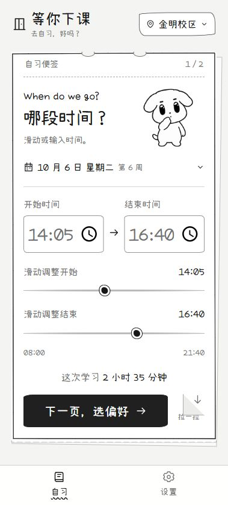
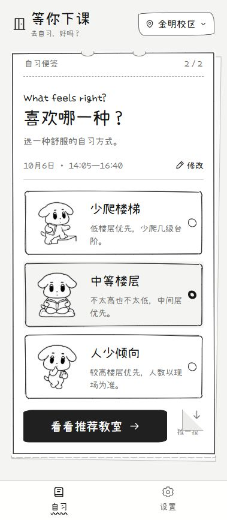
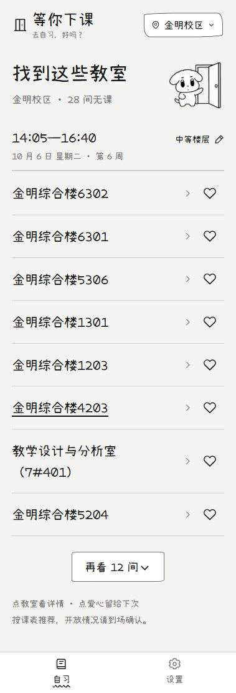

<div align="center">
  
  <h1>等你下课</h1>
  <p>去自习，好吗？</p>
  <p>河南大学无课教室推荐 · 手绘便签 · 网页与安卓</p>
  <p><a href="https://henu-study.pages.dev/">打开网页版</a> · <a href="https://henu-study.pages.dev/downloads/dengni-xiake-v1.2.5.apk">下载安卓 1.2.5 公开试用版</a></p>
</div>

在校园里找自习教室时，逐间查课表很费时间。**等你下课**根据导出的教室课表，
筛选整个学习时段内无课的教室，再按照楼栋、收藏和楼层偏好排序。

目前支持河南大学开封的明伦、金明两个校区，共 **235 间可查询教室**。
界面使用黑白手绘便签和不同动作的咖喱狗，操作流程为 **选时间 → 选偏好 → 看推荐**。

**本分支为安卓1.2.5公开试用版。** 新增启动自动检查更新与设置手动检查；固定正式网站提供最新版本。iPhone网页版支持通过Safari快捷指令读取学校课表后预览保存、切周与修改，首次需在手机配置指令，无网页桌面组件。两页导入已有用户确认，新的更新与iPhone流程仍需手机反馈。步骤和验证限制见[1.2.5说明](docs/releases/1.2.5-public-beta.md)。

## 界面预览

| 选择时间 | 选择偏好 | 推荐教室 |
| --- | --- | --- |
|  |  |  |

截图来自当前网页版；安卓使用同一套界面。时间与偏好页支持点击下一步或向下拉动纸角的撕页过渡。

## 功能

- **整段时间筛选**：结合日期、教学周、单双周和学校节次，排除学习时段内有课程重叠的教室。
- **三种偏好**：少爬楼梯、中等楼层、人少倾向；最后一项按较高楼层排序。
- **校园规则**：曾宪梓楼排除；金明综合楼与七号教学楼优先，计算机大楼后备。
- **收藏优先**：喜欢的教室保存于当前设备，在符合无课条件的同一楼栋组内优先推荐。
- **简洁详情**：列表展示教室名称与爱心，点击教室查看当天课程占用和无课时段。
- **安卓内置资源**：页面、课表、字体与图片随 APK 提供，无需另装 Chrome。
- **自动与手动检查更新**：安卓启动后检查固定网站的公开版本信息，新版轻提示；设置可随时检查，确认后打开同一下载页。
- **个人课表**：底部为“自习 / 我的课表 / 设置”；安卓学校原网页登录后自动读取本学期课表，预览确认才保存。
- **周视图与本地修正**：七天适应手机屏幕，连堂课程按节数占格，支持双指及按钮缩放。点课程修改名称、教室、星期、节次、教学周与备注，可恢复手机中保存的原学校记录。
- **安卓桌面组件（待真机验收）**：今日课程与本周课表，使用本地修改后的有效课表；支持调整大小、手动刷新及点课程进入详情。
- **同步确认**：相同安排不重复，保护本地修改；学校同时改变字段、移除课程或拆分安排时明确选择。“替换为另一份课表”不会沿用旧修正。

## 使用

### 网页 / iPhone

打开 [henu-study.pages.dev](https://henu-study.pages.dev/)，选校区与学习时段。
iPhone 可在 Safari 分享菜单中选择“添加到主屏幕”。当前没有原生 iOS 安装包，网页版请联网使用。

### 安卓

下载 [1.2.5 APK](https://henu-study.pages.dev/downloads/dengni-xiake-v1.2.5.apk)，或使用仓库内
`dist/downloads/dengni-xiake-v1.2.5.apk`。需要 Android 8 及以上、系统 WebView 102 及以上。
已安装旧版时直接覆盖安装，保留原应用数据；正常同签名更新应保留收藏与偏好，具体效果请在手机确认。

### 本地预览

准备 Python，在仓库根目录运行：

```sh
python serve.py
```

然后访问 `http://127.0.0.1:8787/`。Windows 也可以双击 `启动预览.cmd`。
手机与电脑连接同一 Wi-Fi 后，可使用预览窗口显示的局域网地址。电脑上的预览服务需要保持运行。

## 实现与开发

| 部分 | 实现 |
| --- | --- |
| 网页界面 | 原生 HTML / CSS / JavaScript、Hash 路由、Rough.js 手绘线条 |
| 推荐逻辑 | `core.js` 的时间区间筛选与规则排序 |
| 交互规则 | `flow.js` 的时间校验、滑块调整与撕页条件 |
| 数据导入 | Python + xlrd，Excel → `data.js` |
| 本机保存 | 教室收藏/偏好用 localStorage；个人课表用安卓私有 AtomicFile，无云同步 |
| 安卓 | Java Activity + WebViewAssetLoader，加载包内网页资源 |
| 网站托管 | Cloudflare Pages |

查询在用户设备上计算，不依赖自建查询后台，也不要求用户提交教务账号。

个人课表是独立数据，不能作为全校无课教室的完整证据。导入由用户在学校原网页登录，程序只提取课程名称、课程及教学班编号、选中状态和时间地点；不提取学生姓名、学号或任课教师。课程留在本机，不发送给开发者，也不写回学校。导入结束或取消时清理本应用的学校 WebView 会话；重新同步可能需要重新登录，实际设备上的清理仍待验证。可在“我的课表”中删除个人课表，教室收藏会保留。

```text
.
├── dist/                  网页、课表、运行资源与下载文件
│   ├── app.js             界面与交互
│   ├── core.js            无课判断与推荐排序
│   ├── flow.js            输入和撕页规则
│   ├── personal-timetable.js 周次解析、本地修改与同步合并
│   ├── timetable-ui.js     个人课表页面与原生消息客户端
│   ├── henu-schedule-adapter.js 学校个人课表的最小只读提取
│   ├── data.js            导入后的课表占用
│   └── android-update.html 版本检查页面
├── android/               安卓工程与原生测试
├── docs/images/           当前界面截图
├── import_schedule.py     开发者课表导入工具
├── serve.py               本地预览服务
└── test-*.cjs             前端自动测试
```

### 前端测试

准备 Node.js 和 npm，在根目录执行：

```sh
npm install
npm test
```

覆盖日期/周次、单双周、时间冲突、楼栋和收藏排序、时间输入、撕页流程、安卓模式设置与版本页。
当前核心验证包含 **402948 次节次对照**。十个界面/业务测试脚本覆盖导入确认、取消、编辑、存储失败、跨周刷新、同步冲突与消息请求 ID；另有发布产物测试直接核对 APK 哈希、字节数和包内脚本，避免网页更新但 APK 仍装旧页面。

### 安卓构建

准备 JDK 17、Android SDK 35，并配置本机 SDK 路径。工程使用 Gradle Wrapper：

```sh
cd android
./gradlew :app:testDebugUnitTest :app:assembleDebug
```

Windows 使用 `gradlew.bat`。正式发布还需提供仓库外的私密签名配置；签名密钥与密码不在此仓库中。
新版本需要递增 versionCode，沿用原包名与签名，并同步包内版本、更新页和下载信息。

1.2.5 为 versionCode 11，沿用 1.0.1 签名；私人签名配置通过 `-PstudySigningProperties=/仓库外/signing.properties` 传入。推广时将本分支完整公开目录发布到固定正式网站；不得只更新Preview，否则旧App仍无法发现新版。

### 更新课表

开发者安装 xlrd 后，可以将同格式课表重新导入：

```sh
python -m pip install xlrd
python import_schedule.py "新课表.xls"
```

当前导入器针对 2026—2027 第一学期；更换学期需要同步调整导入校验、学期首周与作息。
生成的数据仅保留教室和课程占用，不包含教师、班级或学生信息。原始 XLS 不在仓库中。

## 数据范围与已知限制

- 数据导出时间：**2026-10-03 21:46**；第一周周一：**2026-08-31**。
- 原始结构化数据包含 246 间 / 3722 条课程安排，按当前规则实际开放查询 235 间。
- “无课”表示导出课表中无课程冲突，不能保证教室开门、无人自习或没有临时活动。
- “人少倾向”是楼层规则，不是实时人数统计；目前没有电脑、插座或开放状态的动态数据。
- 收藏只在当前设备与来源中保存，不同浏览器、网页版和安卓之间不自动同步。
- 全校教室课表与新版发布依赖人工维护，已安装安卓启动后自动检查公开版本；个人课表由用户主动同步，没有后台定时登录、多学期通用配置或持续集成。
- 安卓 1.0.0 已由用户在手机试用并反馈良好；1.0.1 的覆盖更新、收藏保留及更新入口待进一步确认。
- 1.2.5 的前端逻辑／发布产物检查、安卓框架测试及构建通过，包含严格字段检查、来源限制、失败写入回滚、共享投影、组件布局和包内跳转。具体数量及验收步骤见版本测试说明；框架模拟不能代替真实学校会话清理、桌面添加或手机覆盖更新测试。
- 个人课表目前只适配河南大学 2026—2027 第一学期。空地点明确提示，无法识别的安排保留原文字但不伪造课程时间；学校页面结构变化、验证码或网络状态可能影响导入。
- 今日／本周桌面组件已实现；自动刷新受手机桌面及省电策略影响，可手动刷新。课程／学习通知尚未实现。

## 后续方向

1. 补全不同手机、覆盖安装、断网重启与 iPhone 添加桌面的验证。
2. 将学期、作息、校区和楼栋规则整理为更容易维护的配置。
3. 统一版本与发布信息，补上自动测试和发布流程。
4. 在确有需要时接入活动占用等动态数据。

## 参考与资源

- [WhereToSleep](https://github.com/name1e5s/WhereToSleep)：课表导出转结构化数据的处理思路与目录介绍方式。
- [QFNUFreeClassroomsFinder](https://github.com/w1ndys/QFNUFreeClassroomsFinder)：空闲教室查询场景，以及功能、运行方法、限制与反馈的 README 组织方式。
- [Wired Elements](https://github.com/rough-stuff/wired-elements)：手绘界面外观参考，未引入其组件库。
- [Rough.js](https://github.com/rough-stuff/rough)：使用其 MIT 许可的手绘线条库。
- [小赖字体](https://github.com/lxgw/kose-font)：使用 OFL 许可字体的项目字形子集。

代码与插画在 AI 辅助下迭代实现。以上同类项目作为思路与介绍方式的参考，不将其项目代码作为本项目源码发布。

## 许可证

本项目自行编写的代码与文档采用 [MIT License](LICENSE)。允许使用、修改、分发与商用，使用时需保留版权声明和许可证全文。

第三方代码、字体及依赖继续遵循各自原有许可证，详见 [THIRD_PARTY_NOTICES.md](THIRD_PARTY_NOTICES.md)；完整许可文件保留在 `dist/assets/`。

MIT 授权不包含学校课表数据（`dist/data.js`）、咖喱狗插画与应用图标（`dist/assets/ink-dog-*.png`），以及应用名称与品牌标识；界面截图中的上述素材也不因截图收录而获得 MIT 授权。它们随当前应用提供，不视为授予独立再利用、再分发或品牌使用的权利。需要另行使用时，请先确认相应权利和授权。

问题或建议欢迎通过仓库 Issues 反馈。反馈查询问题时，请提供校区、日期、时段和偏好，并说明课表结果与现场情况。
